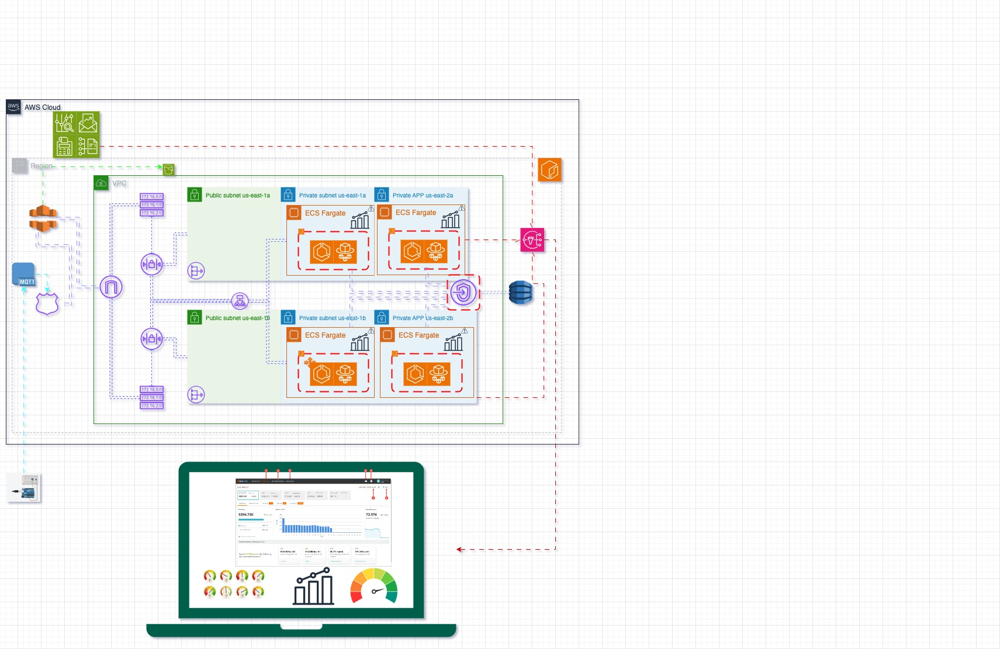

# **Challenge Webmotors 2022 - Fiap**
## Projeto CoudIt

## Objetivo

Desenvolvimento de uma solução para monitoramento de temperatura de frigorifico urbana. Sendo assim a equipe CloudIt irá desenvolver um site para:

- Venda
- Compra
- cadastro

## Desenvolvimento

#### Etapas de desenvolvimento

- Desenvolvimento do sistema de monitoramento
- Desenvolvimento do sistema de case de segurança
- Criação do site
- Integração do site com os provedores de cloud (AWS)
- Integração do backend com ESP32  

#### Etapa 1

**Desenvolvimento do sistema de monitoramento**

Nesta etapa desenvolvemos o sistema de monitoramento utiizando tecnologias iot (internet of things). Para isso utilizamos os seguintes componentes:

- NODE MCU ESP32
- Potenciômetro 10 ohm
- Módulo MCP2515
- Sensor DHT22

#### Etapa 2

**Criação do IAC da plataforma**

Nesta etapa desenvolvemos o desenho de arquitetura na GCP e AWS que se encontra dentro da pasta **arquitetura**.

Abaixo temos o desenho de arquitetura no provedor da AWS:

